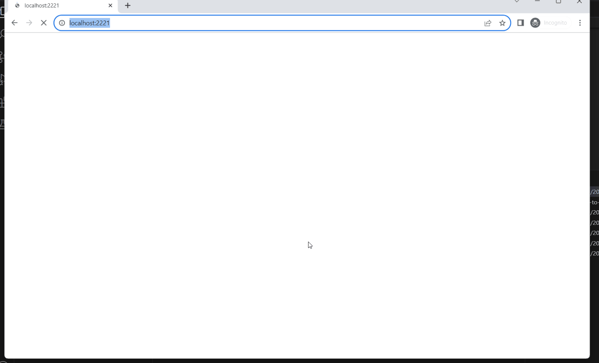

## Automated Web Testing with JavaScript and Playwright

##	Table of contents

- [Technologies and tools](#technologist-technologies-and-tools)
- [Implemented checks](#bookmark-tabs-implemented-checks)
- [E2E test video](#-test-running-example)

## Technologies and tools

<code></code>
<code></code>
<code></code>
<code></code>
<code></code>

## Implemented checks:

- ✓ Product page can be opened
- ✓ Sort products by cheapest
- ✓ Add products to busket
- ✓ Go to Checkout page
- ✓ Remove cheapest product 
- ✓ Continue to checkout
- ✓ Move to sign up.
- ✓ Register a new user
- ✓ Fill delivery details
- ✓ Save delivery details
- ✓ Continue to payment
- ✓ Activate discount
- ✓ Fill payment details
- ✓ Complete payment

## E2E test video

  

